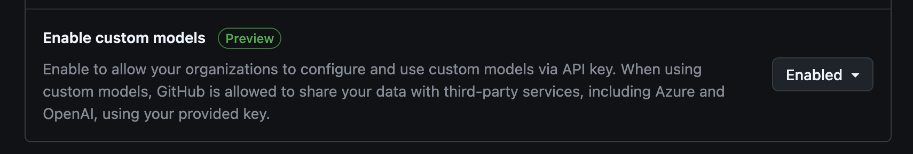
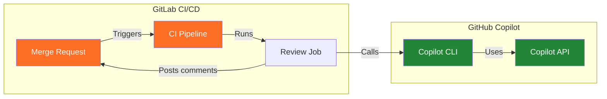
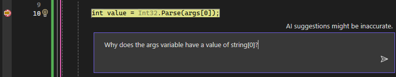

# GitHub Copilot Advanced Features

## Choosing the Right Model

GitHub Copilot supports multiple AI models, each with different strengths. Selecting the right model for your task can significantly impact code quality, speed, and reasoning depth.

### Model Selection in VS Code


1. Open Copilot Chat (`Cmd + Shift + I` / `Ctrl + Shift + I`)
2. Click the model selector dropdown at the top of the chat panel
3. Choose your preferred model

### Model Suggestions

| Model | Best For | Strengths | Considerations |
|-------|----------|-----------|----------------|
| **Claude Sonnet 4.5** | Daily coding tasks | Fast, balanced quality/speed, excellent for refactoring | Default recommendation for most work |
| **Claude Opus 4.5** | Complex architecture, deep reasoning | Superior reasoning, handles nuanced problems, best for multi-file refactors | Slower, higher resource usage |
| **Gemini 3.0 Pro** | Large context, multimodal tasks | Massive context window (1M tokens), good for analyzing large codebases | May require different prompting style |

### When to Switch Models

| Scenario | Recommended Model |
|----------|-------------------|
| Quick code completions, simple edits | Claude Sonnet 4.5 |
| Complex debugging, architectural decisions | Claude Opus 4.5 |
| Analyzing entire codebases, large file contexts | Gemini 3.0 Pro |
| Security audits, deep code review | Claude Opus 4.5 |
| Rapid prototyping | Claude Sonnet 4.5 |
---

## Custom Models (BYOK - Bring Your Own Key)

GitHub Copilot allows you to configure **custom models** from external providers like Azure OpenAI, Anthropic, or Google Cloud. This enables enterprise scenarios where you need specific model versions, data residency, or cost control.



### Configuring Custom Models in VS Code

1. Open VS Code Settings (`Cmd + ,` / `Ctrl + ,`)
2. Search for `github.copilot.chat.models`
3. Add your custom model configuration

### Example Configuration

```json
{
    "github.copilot.chat.azureModels": {
        "custom-model": {
            "name": "My own GPT-4.1 Mini",
            "maxInputTokens": 64000,
            "maxOutputTokens": 16000,
            "toolCalling": true,
            "url": "https://abt-foundry.cognitiveservices.azure.com/openai/deployments/gpt-4.1-mini/chat/completions?api-version=2025-01-01-preview",
            "vision": false
        }
    },
}
```

### Use Cases for Custom Models

| Use Case | Benefit |
|----------|---------|
| **Data residency** | Use Azure OpenAI in specific regions |
| **Cost control** | Route to your own API quotas |
| **Model versioning** | Pin to specific model versions |
| **Enterprise compliance** | Use approved endpoints only |

---

## GitHub Copilot Code Review in GitLab CI/CD

While GitHub Copilot Code Review is designed for GitHub Pull Requests, you can leverage the **GitHub Copilot CLI** and **API** to integrate AI-powered code review into GitLab CI/CD pipelines.

### Architecture Overview



### GitLab CI/CD Integration Steps

To integrate GitHub Copilot code review into your GitLab CI/CD pipeline, you'll need to implement the following steps:

#### 1. **Environment Setup**
- Use a Node.js v22+ container image
- Configure the job to run only on merge request events
- Install the GitHub Copilot CLI: `npm install -g @github/copilot`

#### 2. **Authentication**
- **Generate a Fine-grained Personal Access Token (PAT)**:
  1. Go to [GitHub Settings > Developer settings > Personal access tokens > Fine-grained tokens](https://github.com/settings/personal-access-tokens/new)
  2. Click **Generate new token**
  3. Under **Permissions**, select **Account permissions**
  4. Select **Copilot Requests** and set to **Read-only** (or Access)
  5. Generate the token
- **Configure CI/CD Variables**:
  - Set `GITHUB_TOKEN` environment variable with your new Fine-grained PAT
  - Configure a `GITLAB_TOKEN` for posting comments back to merge requests
  - Store these tokens as CI/CD variables (masked and protected)

#### 3. **Fetch Code Changes**
- Fetch the target branch to ensure you have the full git history
- Generate a diff between the merge request source and target branches
- Save the diff to a file for processing

#### 4. **AI Code Review**
- Run the GitHub Copilot CLI in non-interactive mode using the `-p` (prompt) flag
- Example command structure:
  ```bash
  copilot -p "Review this code change for bugs, security issues, and best practices: $(cat diff.txt)" \
    --allow-all-tools \
    --silent > review.md
  ```
- Alternatively, consider using AI APIs directly (Azure OpenAI, Anthropic Claude) for more control

#### 5. **Post Review Results**
- Parse the review output from Copilot
- Use GitLab's API to post the review as a merge request comment

### GitHub Actions Example

For a complete working example of integrating GitHub Copilot Code Review into GitHub Actions, see the [copilot-code-review.yml](../.github/workflows/copilot-code-review.yml) workflow file in this repository.

### Local Testing

To test the Copilot code review feature locally:

```bash
# 1. Install GitHub Copilot CLI
npm install -g @github/copilot

# 2. Authenticate (first time only)
copilot
# Follow prompts to login with GitHub, then exit

# 3. Get diff of your last commit
git diff HEAD~1..HEAD > last_commit.diff

# 4. Run code review in non-interactive mode
copilot -p "Review this code change for bugs, security issues, and best practices: $(cat last_commit.diff)" \
  --allow-all-tools \
  --silent > review.md

# 5. View the review
cat review.md
```

### Required Secrets

| Variable | Description |
|----------|-------------|
| `GITHUB_COPILOT_TOKEN` | GitHub token with Copilot access |
| `GITLAB_TOKEN` | GitLab token for posting MR comments |

### Limitations

| Limitation | Workaround |
|------------|------------|
| No native GitLab integration | Use CLI in non-interactive mode with `-p` and `--allow-all-tools` |
| No inline comments | Post summary as MR note |
| Premium request quota | Monitor usage with `--log-level info`, implement retry logic |
| Large diffs may exceed token limits | Split large changes into smaller reviews |

> **Note:** The GitHub Copilot CLI (`@github/copilot`) supports both interactive and non-interactive modes. For automated CI/CD code review:
> - Use `-p "your prompt"` for non-interactive mode
> - Add `--allow-all-tools` to automatically approve all tool executions
> - Add `--silent` to get clean output suitable for parsing
> - Each review consumes one premium request from your monthly quota

---

## Copilot-Assisted Debugging (Copilot-unterstütztes Debugging)

GitHub Copilot can significantly accelerate debugging by analyzing errors, suggesting fixes, and explaining complex stack traces.

### Debugging Workflows

#### 1. Inline Error Analysis

When an error occurs in your code:

1. Hover over the red squiggly underline
2. Click the **Copilot sparkle icon** ✨
3. Select **"Fix with Copilot"** or **"Explain this error"**

#### 2. Debug Console Integration

While debugging a running application:

1. When execution stops at a breakpoint or exception
2. Open Copilot Chat (`Cmd + Shift + I`)
3. Use the `/fix` command or ask directly:

```
Why is this variable undefined at this point?
```

```
Explain this stack trace and suggest a fix
```

#### 3. Terminal Error Analysis

When you encounter errors in the terminal:

1. Click the **✨ sparkle icon** next to the error
2. Or select the error text and use **"Explain with Copilot"**
3. Copilot analyzes the error and suggests solutions

### Debugging Slash Commands

| Command | Purpose |
|---------|---------|
| `/fix` | Analyze selected code and suggest a fix |
| `/explain` | Explain what the code does and why it might fail |
| `/tests` | Generate tests to reproduce and prevent the bug |

### Best Practices for Debugging with Copilot

| Practice | Reason |
|----------|--------|
| Include the full error message | Context helps Copilot identify the root cause |
| Share relevant code context | Open related files before asking |
| Describe what you expected | Helps Copilot understand the gap |
| Ask follow-up questions | Refine the solution iteratively |

### Example Debugging Prompts

```
This function throws "Cannot read property 'id' of undefined" 
when the user array is empty. How can I fix this?
```

```
Explain why this async function doesn't wait for the API call 
to complete before returning
```

```
The test passes locally but fails in CI with a timeout. 
What could cause this difference?
```

### Debugging with Copilot in Visual Studio

Visual Studio offers enhanced AI-powered debugging capabilities that understand your call stacks, frames, variables, and exceptions. When debugging in Visual Studio, you can leverage the **Ask Copilot** button for context-aware assistance without needing to manually provide debugging context.



#### Key AI-Enhanced Debugging Features

| Feature | Capability |
|---------|------------|
| **Exception Analysis** | Get instant explanations and fixes when exceptions occur, including deadlock detection |
| **Variable Inspection** | AI assistance in Autos and Locals windows to understand variable states |
| **Conditional Breakpoints** | AI-generated suggestions for breakpoint conditions and tracepoints |
| **LINQ Query Analysis** | Hover over LINQ queries to analyze return values with Copilot |
| **Data Tips** | Get AI explanations when hovering over variables during debugging |
| **Call Stack Analysis** | Understand complex execution paths with AI assistance |

#### Quick Debugging Workflow

1. **When an exception occurs**: Click the **Ask Copilot** button in the exception helper
2. **Review suggestions**: Copilot provides analysis, explanations, and code fixes
3. **Preview and apply**: Use the **Preview** button to review suggested fixes before applying
4. **Continue debugging**: Restart the debugger to verify the fix

The AI understands your debugging context including the current call stack, exception details, and variable values, so you can ask questions directly without providing additional context.

---

## Useful Links

- [GitHub Copilot Model Selection](https://docs.github.com/en/copilot/how-tos/use-ai-models/change-the-chat-model)
- [Copilot CLI Documentation](https://github.com/features/copilot/cli)
- [Playwright MCP Server](https://github.com/microsoft/playwright-mcp)
- [Debugging with Copilot](https://code.visualstudio.com/docs/copilot/debugging)
- [Debugging with Copilot in Visual Studio](https://learn.microsoft.com/en-us/visualstudio/debugger/debug-with-copilot?view=visualstudio)
