# Spec Kit - Specification-Driven Development

## What is Spec Kit?

**Spec Kit** is an open-source toolkit from GitHub that helps you build software by focusing on **what** you want to create before diving into **how** to build it. Instead of jumping straight into code, Spec Kit guides you through a structured process of defining clear specifications that AI coding assistants (like GitHub Copilot) can follow to generate better, more predictable results.

Think of it as giving your AI assistant a detailed blueprint instead of vague instructions.

## Why Use Spec Kit?

Traditional AI-assisted coding often involves:
- Vague prompts → inconsistent results
- One-shot code generation → missing edge cases
- No structure → hard to iterate and improve

Spec Kit flips this with **Spec-Driven Development (SDD)**:
- Clear specifications → predictable outcomes
- Multi-step refinement → comprehensive solutions
- Structured workflow → easy to iterate and maintain

## How It Works with GitHub Copilot

Spec Kit provides **slash commands** that work directly in your AI coding assistant's chat interface. After initialization, you get access to commands like `/speckit.specify`, `/speckit.plan`, and `/speckit.implement`.

```mermaid
flowchart LR
    subgraph Workflow["Spec-Driven Development Workflow"]
        direction LR
        Constitution["📜 /speckit.constitution<br/>Project Principles"]
        Specify["📋 /speckit.specify<br/>Define What to Build"]
        Plan["🔧 /speckit.plan<br/>Technical Plan"]
        Tasks["📝 /speckit.tasks<br/>Task Breakdown"]
        Implement["🚀 /speckit.implement<br/>Build It"]
    end
    
    Constitution --> Specify --> Plan --> Tasks --> Implement
    
    style Constitution fill:#238636,color:#fff
    style Specify fill:#0969da,color:#fff
    style Plan fill:#8957e5,color:#fff
    style Tasks fill:#bf8700,color:#000
    style Implement fill:#cf222e,color:#fff
```



## Getting Started

### 1. Install the Specify CLI

```bash
# Install using uv (recommended)
uv tool install specify-cli --from git+https://github.com/github/spec-kit.git
```

### 2. Initialize Your Project

```bash
# Create a new project
specify init my-project --ai copilot

# Or initialize in an existing project
specify init . --ai copilot
```

This creates a `.specify/` folder with templates, scripts, and slash command definitions.

### 3. Start Using Slash Commands

Open GitHub Copilot Chat and start with the workflow:

```
/speckit.constitution This project follows security-first principles...
/speckit.specify Build an app that manages photo albums...
/speckit.plan Use React for frontend, Node.js for backend...
```

## Core Slash Commands

| Command | Purpose | When to Use |
|---------|---------|-------------|
| `/speckit.constitution` | Define project principles | At project start — sets rules for all development |
| `/speckit.specify` | Create feature specification | When starting a new feature — focus on *what*, not *how* |
| `/speckit.clarify` | Resolve ambiguities | After `/speckit.specify` — refine unclear requirements |
| `/speckit.plan` | Generate technical plan | After spec is clear — define tech stack & architecture |
| `/speckit.tasks` | Break down into tasks | After plan — create actionable implementation steps |
| `/speckit.implement` | Execute all tasks | After tasks — build the feature according to plan |

## Example Workflow

### Step 1: Define Project Principles

```
/speckit.constitution This project follows a "Library-First" approach. 
All features must be implemented as standalone libraries first. 
We use TDD strictly. We prefer functional programming patterns.
```

### Step 2: Create the Specification

Focus on **what** you're building, not the tech stack:

```
/speckit.specify Build Taskify, a team productivity platform. Users can create 
projects, add team members, assign tasks, and move tasks between Kanban boards. 
There should be 5 predefined users: 1 product manager and 4 engineers.
```

### Step 3: Generate Technical Plan

Now specify your tech choices:

```
/speckit.plan Use .NET Aspire with Postgres. Frontend with Blazor, 
drag-and-drop task boards, real-time updates. REST API with projects, 
tasks, and notifications endpoints.
```

### Step 4: Create Tasks and Implement

```
/speckit.tasks
/speckit.implement
```

## Project Structure After Init

```
your-project/
├── .specify/
│   ├── memory/
│   │   └── constitution.md          # Project principles
│   ├── scripts/
│   │   ├── create-new-feature.sh    # Automation scripts
│   │   └── ...
│   ├── templates/
│   │   ├── spec-template.md         # Specification template
│   │   ├── plan-template.md         # Plan template
│   │   └── tasks-template.md        # Tasks template
│   └── specs/
│       └── 001-feature-name/
│           ├── spec.md              # Feature specification
│           ├── plan.md              # Implementation plan
│           ├── tasks.md             # Task breakdown
│           ├── research.md          # Tech research
│           └── contracts/           # API contracts
└── .github/
    └── prompts/                     # Copilot slash commands
```

## Supported AI Agents

| Agent | Support |
|-------|---------|
| GitHub Copilot | ✅ Full support |
| Claude Code | ✅ Full support |
| Gemini CLI | ✅ Full support |
| Cursor | ✅ Full support |
| Amazon Q Developer | ✅ Full support |

## Best Practices

### ✅ Do

| Practice | Reason |
|----------|--------|
| Be explicit about requirements | Clear specs = better code |
| Separate *what* from *how* | Focus on requirements in spec, tech stack in plan |
| Iterate with `/speckit.clarify` | Resolve ambiguities before coding |
| Review generated plans | Ensure alignment with your vision |

### ❌ Don't

| Anti-pattern | Why |
|--------------|-----|
| Jump straight to `/speckit.implement` | Missing context leads to poor results |
| Include tech stack in specifications | Mixes concerns, limits flexibility |
| Skip the constitution step | No guardrails for consistent development |
| Ignore generated documentation | Miss valuable context and decisions |

## Key Takeaways

1. **Specifications first** — Define what you want before how to build it
2. **Structured workflow** — Follow the progression: constitution → spec → plan → tasks → implement
3. **AI-friendly** — Slash commands work directly in GitHub Copilot Chat
4. **Iterative refinement** — Use `/speckit.clarify` to improve specs before implementation
5. **Technology agnostic** — Works with any tech stack you specify in the planning phase

## Useful Links

- [Spec Kit GitHub Repository](https://github.com/github/spec-kit)
- [Quick Start Guide](https://github.github.io/spec-kit/quickstart.html)
- [Spec-Driven Development Methodology](https://github.com/github/spec-kit/blob/main/spec-driven.md)
- [Video Overview](https://www.youtube.com/watch?v=a9eR1xsfvHg)
