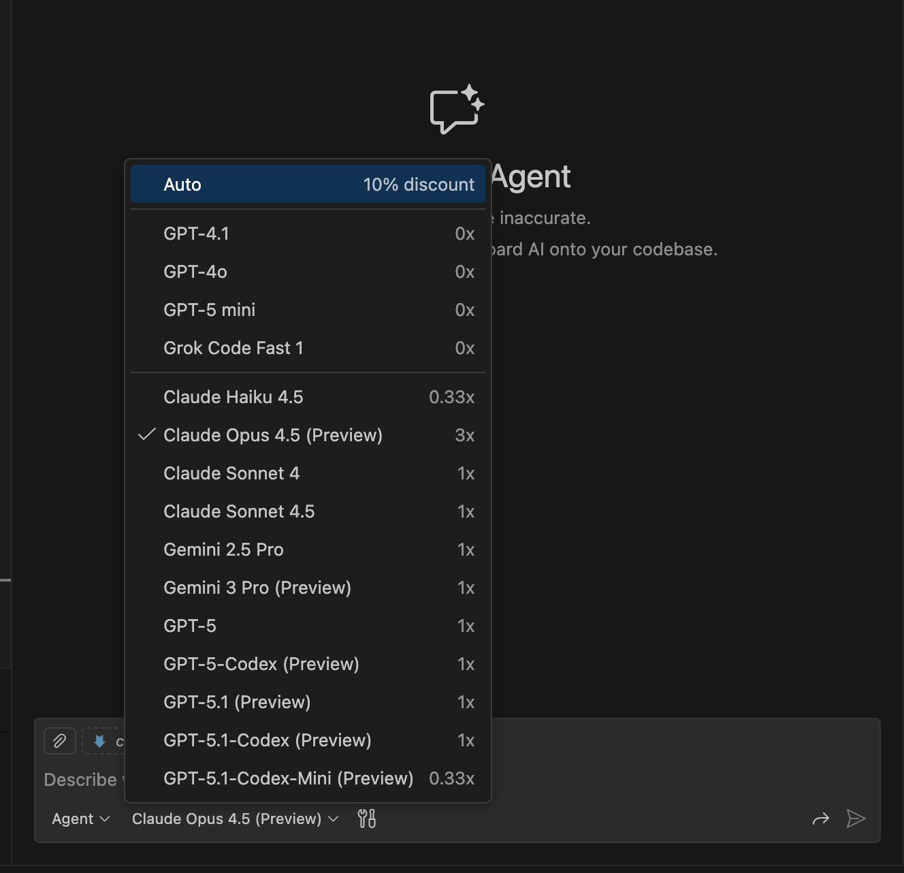
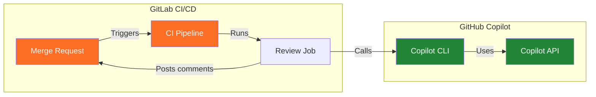

# GitHub Copilot Advanced Features

## Choosing the Right Model

GitHub Copilot supports multiple AI models, each with different strengths. Selecting the right model for your task can significantly impact code quality, speed, and reasoning depth.

### Model Selection in VS Code



1. Open Copilot Chat (`Cmd + Shift + I` / `Ctrl + Shift + I`)
2. Click the model selector dropdown at the top of the chat panel
3. Choose your preferred model

### Model Suggestions

| Model | Best For | Strengths | Considerations |
|-------|----------|-----------|----------------|
| **Claude Sonnet 4.5** | Daily coding tasks | Fast, balanced quality/speed, excellent for refactoring | Default recommendation for most work |
| **Claude Opus 4.5** | Complex architecture, deep reasoning | Superior reasoning, handles nuanced problems, best for multi-file refactors | Slower, higher resource usage |
| **Gemini 3.0 Pro** | Large context, multimodal tasks | Massive context window (1M tokens), good for analyzing large codebases | May require different prompting style |

### When to Switch Models

| Scenario | Recommended Model |
|----------|-------------------|
| Quick code completions, simple edits | Claude Sonnet 4.5 |
| Complex debugging, architectural decisions | Claude Opus 4.5 |
| Analyzing entire codebases, large file contexts | Gemini 3.0 Pro |
| Security audits, deep code review | Claude Opus 4.5 |
| Rapid prototyping | Claude Sonnet 4.5 |
---

## Custom Models (BYOK - Bring Your Own Key)

GitHub Copilot allows you to configure **custom models** from external providers like Azure OpenAI, Anthropic, or Google Cloud. This enables enterprise scenarios where you need specific model versions, data residency, or cost control.

### Configuring Custom Models in VS Code

1. Open VS Code Settings (`Cmd + ,` / `Ctrl + ,`)
2. Search for `github.copilot.chat.models`
3. Add your custom model configuration

### Example Configuration

```json
{
    "github.copilot.chat.models": [
        {
            "vendor": "azure",
            "family": "gpt-4o",
            "id": "gpt-4o-2024-05-13",
            "name": "Azure GPT-4o (Custom)",
            "endpoint": "https://your-resource.openai.azure.com/",
            "apiKey": "${env:AZURE_OPENAI_KEY}"
        },
        {
            "vendor": "anthropic",
            "family": "claude",
            "id": "claude-sonnet-4-20250514",
            "name": "Anthropic Claude (Direct)",
            "endpoint": "https://api.anthropic.com/v1",
            "apiKey": "${env:ANTHROPIC_API_KEY}"
        }
    ]
}
```

### Custom Model Properties

| Property | Required | Description |
|----------|----------|-------------|
| `vendor` | ✅ Yes | Provider: `azure`, `anthropic`, `google`, `openai` |
| `family` | ✅ Yes | Model family: `gpt-4o`, `claude`, `gemini` |
| `id` | ✅ Yes | Specific model version ID |
| `name` | ✅ Yes | Display name in model picker |
| `endpoint` | ✅ Yes | API endpoint URL |
| `apiKey` | ✅ Yes | API key (use `${env:VAR}` for environment variables) |

### Use Cases for Custom Models

| Use Case | Benefit |
|----------|---------|
| **Data residency** | Use Azure OpenAI in specific regions |
| **Cost control** | Route to your own API quotas |
| **Model versioning** | Pin to specific model versions |
| **Enterprise compliance** | Use approved endpoints only |

---

## GitHub Copilot Code Review in GitLab CI/CD

While GitHub Copilot Code Review is designed for GitHub Pull Requests, you can leverage the **GitHub Copilot CLI** and **API** to integrate AI-powered code review into GitLab CI/CD pipelines.

### Architecture Overview



### GitLab CI/CD Integration Steps

To integrate GitHub Copilot code review into your GitLab CI/CD pipeline, you'll need to implement the following steps:

#### 1. **Environment Setup**
- Use a Node.js v22+ container image
- Configure the job to run only on merge request events
- Install the GitHub Copilot CLI: `npm install -g @github/copilot`

#### 2. **Authentication**
- Set up a `GITHUB_TOKEN` environment variable with your GitHub Copilot token
- Configure a `GITLAB_TOKEN` for posting comments back to merge requests
- Store these tokens as CI/CD variables (masked and protected)

#### 3. **Fetch Code Changes**
- Fetch the target branch to ensure you have the full git history
- Generate a diff between the merge request source and target branches
- Save the diff to a file for processing

#### 4. **AI Code Review**
- Run the GitHub Copilot CLI in non-interactive mode using the `-p` (prompt) flag
- Use `--allow-all-tools` to automatically approve all tool executions (required for CI/CD)
- Use `--silent` flag to output only the response without stats
- Example command structure:
  ```bash
  copilot -p "Review this code change for bugs, security issues, and best practices: $(cat diff.txt)" \
    --allow-all-tools \
    --silent > review.md
  ```
- Alternatively, consider using AI APIs directly (Azure OpenAI, Anthropic Claude) for more control

#### 5. **Post Review Results**
- Parse the review output from Copilot
- Use GitLab's API to post the review as a merge request comment

### Local Testing

To test the Copilot code review feature locally:

```bash
# 1. Install GitHub Copilot CLI
npm install -g @github/copilot

# 2. Authenticate (first time only)
copilot
# Follow prompts to login with GitHub, then exit

# 3. Get diff of your last commit
git diff HEAD~1..HEAD > last_commit.diff

# 4. Run code review in non-interactive mode
copilot -p "Review this code change for bugs, security issues, and best practices: $(cat last_commit.diff)" \
  --allow-all-tools \
  --silent > review.md

# 5. View the review
cat review.md
```

### Required Secrets

| Variable | Description |
|----------|-------------|
| `GITHUB_COPILOT_TOKEN` | GitHub token with Copilot access |
| `GITLAB_TOKEN` | GitLab token for posting MR comments |

### Limitations

| Limitation | Workaround |
|------------|------------|
| No native GitLab integration | Use CLI in non-interactive mode with `-p` and `--allow-all-tools` |
| No inline comments | Post summary as MR note |
| Premium request quota | Monitor usage with `--log-level info`, implement retry logic |
| Large diffs may exceed token limits | Split large changes into smaller reviews |

> **Note:** The GitHub Copilot CLI (`@github/copilot`) supports both interactive and non-interactive modes. For automated CI/CD code review:
> - Use `-p "your prompt"` for non-interactive mode
> - Add `--allow-all-tools` to automatically approve all tool executions
> - Add `--silent` to get clean output suitable for parsing
> - Each review consumes one premium request from your monthly quota

---

## Copilot-Assisted Debugging (Copilot-unterstütztes Debugging)

GitHub Copilot can significantly accelerate debugging by analyzing errors, suggesting fixes, and explaining complex stack traces.

### Debugging Workflows

<!-- 📸 SCREENSHOT: Copilot inline error fix suggestion in VS Code -->

#### 1. Inline Error Analysis

When an error occurs in your code:

1. Hover over the red squiggly underline
2. Click the **Copilot sparkle icon** ✨
3. Select **"Fix with Copilot"** or **"Explain this error"**

<!-- 📸 SCREENSHOT: Copilot sparkle icon on error hover -->

#### 2. Debug Console Integration

While debugging a running application:

1. When execution stops at a breakpoint or exception
2. Open Copilot Chat (`Cmd + Shift + I`)
3. Use the `/fix` command or ask directly:

```
Why is this variable undefined at this point?
```

```
Explain this stack trace and suggest a fix
```

#### 3. Terminal Error Analysis

When you encounter errors in the terminal:

<!-- 📸 SCREENSHOT: Terminal error with "Explain with Copilot" button -->

1. Click the **✨ sparkle icon** next to the error
2. Or select the error text and use **"Explain with Copilot"**
3. Copilot analyzes the error and suggests solutions

### Debugging Slash Commands

| Command | Purpose |
|---------|---------|
| `/fix` | Analyze selected code and suggest a fix |
| `/explain` | Explain what the code does and why it might fail |
| `/tests` | Generate tests to reproduce and prevent the bug |

### Best Practices for Debugging with Copilot

| Practice | Reason |
|----------|--------|
| Include the full error message | Context helps Copilot identify the root cause |
| Share relevant code context | Open related files before asking |
| Describe what you expected | Helps Copilot understand the gap |
| Ask follow-up questions | Refine the solution iteratively |

### Example Debugging Prompts

```
This function throws "Cannot read property 'id' of undefined" 
when the user array is empty. How can I fix this?
```

```
Explain why this async function doesn't wait for the API call 
to complete before returning
```

```
The test passes locally but fails in CI with a timeout. 
What could cause this difference?
```

---

## Developing with Playwright MCP Server

The **Playwright MCP Server** enables GitHub Copilot to control a real browser, making it an incredibly powerful tool for web development, testing, and automation.

### What Playwright MCP Enables

| Capability | Description |
|------------|-------------|
| **Live browser control** | Copilot can navigate, click, type, and interact with web pages |
| **Visual debugging** | See exactly what Copilot sees in the browser |
| **Test generation** | Create Playwright tests from natural language |
| **Web scraping** | Extract data from websites with AI assistance |
| **UI development** | Build and iterate on UI with real-time browser feedback |

### Setup

#### 1. Configure MCP Server

Add to your `mcp.json` (see [MCP Server guide](mcp-server.md) for file locations):

```jsonc
{
    "servers": {
        "playwright": {
            "type": "stdio",
            "command": "npx",
            "args": ["@playwright/mcp@latest"]
        }
    }
}
```

#### 2. Start Using in Copilot Chat

Once configured, Copilot can control the browser through natural language:

```
Navigate to our staging site and test the login flow
```

```
Take a screenshot of the homepage and identify accessibility issues
```

### Available Tools

<!-- 📸 SCREENSHOT: Playwright MCP tools list in Copilot Chat -->

| Tool | Description |
|------|-------------|
| `browser_navigate` | Go to a URL |
| `browser_click` | Click on an element |
| `browser_type` | Type text into inputs |
| `browser_snapshot` | Capture page state and accessibility tree |
| `browser_screenshot` | Take a visual screenshot |
| `browser_wait` | Wait for elements or conditions |
| `browser_evaluate` | Execute JavaScript in the page |

### Development Workflows

#### UI Development with Live Feedback

```
Open localhost:3000 and take a snapshot. 
Then suggest CSS improvements for the navigation bar.
```

#### Automated Test Generation

```
Navigate through the checkout flow on our e-commerce site:
1. Add an item to cart
2. Go to checkout
3. Fill in shipping details
4. Verify the order summary

Then generate a Playwright test that covers this flow.
```

#### Visual Regression Testing

```
Take screenshots of all pages in our app and compare them 
to the baseline screenshots in /tests/screenshots/
```

#### Accessibility Auditing

```
Navigate to our marketing site and analyze each page 
for accessibility issues. Create a report with WCAG violations.
```

### Example: Building a Feature with Playwright MCP

```mermaid
flowchart TB
    subgraph Workflow["Development Workflow with Playwright MCP"]
        Start["Start: Feature Request"]
        Navigate["1. Navigate to app"]
        Analyze["2. Analyze current state"]
        Code["3. Write/modify code"]
        Refresh["4. Refresh & validate"]
        Test["5. Generate tests"]
        Done["6. Feature complete"]
    end
    
    Start --> Navigate --> Analyze --> Code --> Refresh
    Refresh -->|"Issues found"| Code
    Refresh -->|"Works correctly"| Test --> Done
    
    style Navigate fill:#45ba4b,color:#fff
    style Analyze fill:#0969da,color:#fff
    style Code fill:#8957e5,color:#fff
    style Test fill:#bf8700,color:#000
```



### Prompt Examples for Playwright Development

| Task | Prompt |
|------|--------|
| **Start development server** | "Open a browser and navigate to localhost:5173, then describe the current UI" |
| **Test a form** | "Fill out the registration form with test data and submit it, then verify the success message" |
| **Debug layout issues** | "Take a screenshot of the mobile view (375px width) and identify layout problems" |
| **Generate E2E tests** | "Walk through the user onboarding flow and generate a Playwright test file" |
| **Check responsive design** | "Take screenshots at mobile, tablet, and desktop widths and compare the layouts" |

### Best Practices

| Practice | Reason |
|----------|--------|
| Start with `browser_snapshot` | Gives Copilot the page structure before acting |
| Be specific about elements | "Click the blue 'Submit' button" vs "Click submit" |
| Use natural flow descriptions | Describe the user journey, not individual clicks |
| Combine with file editing | Let Copilot modify code and immediately verify |

### Configuring Playwright MCP Tools

You can enable/disable specific tools in your `mcp.json`:

```jsonc
{
    "servers": {
        "playwright": {
            "type": "stdio",
            "command": "npx",
            "args": ["@playwright/mcp@latest"],
            "tools": {
                "browser_file_upload": "disabled",
                "browser_pdf_save": "disabled"
            }
        }
    }
}
```

---

## Key Takeaways

1. **Choose models wisely** — Match the model to your task complexity
2. **Custom models enable enterprise scenarios** — BYOK for compliance and cost control
3. **GitLab integration is possible** — Use CLI/API bridge for code review in GitLab CI/CD
4. **Debugging is accelerated** — Let Copilot analyze errors, stack traces, and suggest fixes
5. **Playwright MCP is transformative** — Real browser control enables powerful development and testing workflows

## Useful Links

- [GitHub Copilot Model Selection](https://docs.github.com/en/copilot/how-tos/use-ai-models/change-the-chat-model)
- [Copilot CLI Documentation](https://github.com/features/copilot/cli)
- [Playwright MCP Server](https://github.com/microsoft/playwright-mcp)
- [Debugging with Copilot](https://code.visualstudio.com/docs/copilot/debugging)
- [Debugging with Copilot in Visual Studio](https://learn.microsoft.com/en-us/visualstudio/debugger/debug-with-copilot?view=visualstudio)
