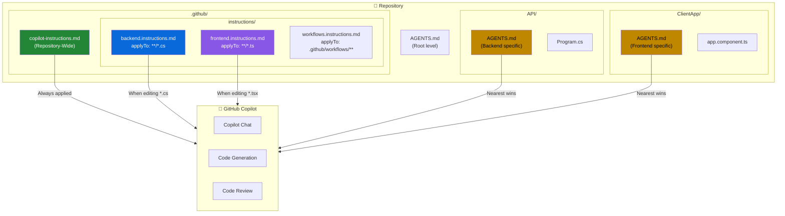

# GitHub Copilot Instructions - Advanced Guide

## What are Copilot Instructions?

**Copilot Instructions** allow you to customize how GitHub Copilot behaves in your projects. They provide persistent context and guidelines that Copilot follows when generating code, reviewing PRs, or answering questions.

## Three Official Instruction Types

| Type | Location | Behavior | Use Case |
|------|----------|----------|----------|
| **Repository-Wide** | `.github/copilot-instructions.md` | Additive (always applied) | Coding standards, tech stack, general guidelines |
| **Path-Specific** | `.github/instructions/*.instructions.md` | Additive (stacks with others) | Backend/frontend specific rules, language conventions |
| **Agent Instructions** | `AGENTS.md` files | Replacement (nearest wins) | folder-level context |

## Architecture Overview



---

## 1. Repository-Wide Instructions

**File:** `.github/copilot-instructions.md`

These instructions apply to **every file** in your repository and are **always additive** — they combine with path-specific and agent instructions.

### Example

```markdown
# Project Guidelines

## Tech Stack
- Backend: .NET 9 with C# 13
- Frontend: Angular 19 with TypeScript
- Database: PostgreSQL with Entity Framework Core
...
```

---

## 2. Path-Specific Instructions

**Location:** `.github/instructions/*.instructions.md`

Target specific files or folders using glob patterns. These are **additive** — multiple instruction files can match the same file and all will be applied together with repository-wide instructions.

### Frontmatter Properties

| Property | Required | Description |
|----------|----------|-------------|
| `applyTo` | ✅ Yes | Glob pattern(s) for matching files |
| `excludeAgent` | ❌ No | Exclude from specific agents (e.g., `code-review`) |

### Example: Backend Instructions

**File:** `.github/instructions/backend.instructions.md`

```markdown
---
applyTo: "SampleApp/**/*.cs"
excludeAgent: "code-review"
---

# Backend Development Guidelines

## Architecture
- Use Clean Architecture with layers: Domain, Application, Infrastructure, API
- Keep controllers thin, move logic to services
...
```

### Glob Pattern Reference

| Pattern | Matches |
|---------|---------|
| `**/*.ts` | All TypeScript files recursively |
| `src/**/*.py` | All Python files in src/ recursively |
| `**/*.{ts,tsx}` | All .ts and .tsx files |
| `*.md` | Markdown files in root only |
| `tests/**` | Everything in tests folder |

---

## 3. Agent Instructions (AGENTS.md)

**File:** `AGENTS.md` (placed in any directory)

Agent instructions use **proximity-based replacement** — the nearest `AGENTS.md` file to the current file wins and **completely replaces** any parent `AGENTS.md` files.

> ⚠️ **Important:** Unlike repository-wide and path-specific instructions (which are additive), AGENTS.md files do **not** inherit from parent directories. If you need shared rules, duplicate them in each AGENTS.md or use path-specific instructions instead.

### How Inheritance Works

```
your-repo/
├── AGENTS.md                    # Root-level defaults
├── API/
│   ├── AGENTS.md                # ← Wins for files in API/
│   └── Program.cs
└── ClientApp/
    ├── AGENTS.md                # ← Wins for files in ClientApp/
    └── app.component.ts
```

### Example: Root AGENTS.md

```markdown
# Repository Agent Instructions

## General Rules
- Follow the coding standards in this repository
- Write clear, self-documenting code
- Suggest tests for new functionality
...
```

### Example: Backend AGENTS.md

**File:** `API/AGENTS.md`

```markdown
# Backend Agent Instructions (.NET)

## Context
This is a .NET 9 Web API with Entity Framework Core.

## Preferences
- Use record types for DTOs
- Use cancellation tokens in async methods
- Prefer minimal APIs over controllers for simple endpoints
...
```

---

## Enabling Instructions in VS Code

### Settings to Enable

| Setting | Purpose |
|---------|---------|
| `github.copilot.chat.codeGeneration.useInstructionFiles` | Enable `.instructions.md` files |
| `github.copilot.chat.useAgentInstructions` | Enable `AGENTS.md` files |

### How to Enable

1. Open VS Code Settings (`Cmd + ,` / `Ctrl + ,`)
2. Search for "copilot instructions"
3. Enable both checkboxes

Or add to `settings.json`:

```json
{
    "github.copilot.chat.codeGeneration.useInstructionFiles": true,
    "github.copilot.chat.useAgentInstructions": true
}
```

---

## Best Practices

### ✅ Do

| Practice | Reason |
|----------|--------|
| Keep instructions focused | Specific guidance is more effective |
| Update as project evolves | Outdated instructions cause confusion |
| Use path-specific for different stacks | Frontend/backend have different needs |
| Include examples | Shows Copilot the expected style |
| Document your tech stack | Helps Copilot use correct APIs |

### ❌ Don't

| Anti-pattern | Why |
|--------------|-----|
| Overly long instructions | Dilutes important guidance |
| Conflicting rules | Creates inconsistent suggestions |
| Too generic advice | "Write good code" isn't actionable |
| Forget to enable in settings | Instructions won't be applied |

---

## Quick Reference: File Locations

```
your-repo/
├── .github/
│   ├── copilot-instructions.md          # Repository-wide (always applied)
│   └── instructions/
│       ├── backend.instructions.md      # Path-specific (applyTo glob)
│       ├── frontend.instructions.md
│       └── workflows.instructions.md
├── AGENTS.md                            # Root agent instructions
├── API/
│   ├── AGENTS.md                        # Backend agents (.NET)
│   └── ...
└── ClientApp/
    ├── AGENTS.md                        # Frontend agents (Angular)
    └── ...
```

---

## Key Takeaways

1. **Layered approach** — Use repository-wide for general rules, path-specific for targeted guidance
2. **Proximity wins** — For AGENTS.md, the closest file to your code takes precedence
3. **Glob patterns** — Master glob syntax to target the right files
4. **Keep it current** — Update instructions as your project evolves
5. **Enable in settings** — Instructions won't work without proper VS Code settings

## Useful Links

- [Customizing Copilot with Instructions](https://docs.github.com/en/copilot/customizing-copilot/adding-custom-instructions-for-github-copilot)
- [Awesome Copilot Instructions Repo](https://github.com/github/awesome-copilot/tree/main/instructions)
