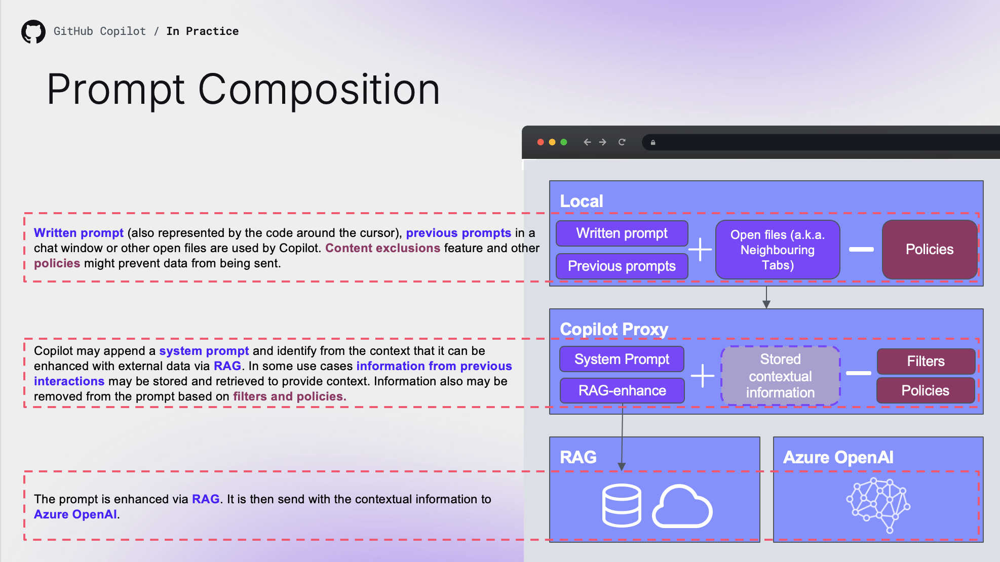

# GitHub Copilot Prompt Engineering

## What is Prompt Engineering?

**Prompt Engineering** is the practice of crafting effective requests to get better results from GitHub Copilot. A prompt includes your question or code snippet, plus any context Copilot uses (current file, chat history, etc.).

### How Copilot Composes Your Prompt



## Core Strategies

| Strategy | Description |
|----------|-------------|
| **Start General → Get Specific** | Begin with broad goals, then add requirements |
| **Give Examples** | Provide sample inputs, outputs, or implementations |
| **Break Down Tasks** | Split complex problems into smaller steps |
| **Avoid Ambiguity** | Be specific about what "this" or "it" refers to |
| **Indicate Relevant Code** | Open related files or use `@workspace` / `@project` |
| **Iterate & Experiment** | Refine prompts based on results |

---

## Best Practices

### 1. Write Clear Instructions

> **Models can't read minds** — be explicit about what you want.

| Issue | Solution |
|-------|----------|
| Long outputs | Ask for brief responses |
| Too simple outputs | Request expert-level detail |
| Wrong format | Provide an example of expected output |

**Tactics:**
1. Include specific details in your prompt
2. Assign a persona ("Act like a senior Java engineer")
3. Use delimiters to separate parts of prompts
4. Specify the steps required to complete the task
5. Provide examples of expected output
6. State the desired output length

### 2. Provide References

> **References reduce confident wrong answers** — especially for citations or URLs.

**Tactics:**
1. Instruct to answer using provided reference text
2. Request citations from specific documentation

### 3. Split Complex Tasks

> **Bigger problems = higher error rates** — divide and conquer.

Just like in software engineering, solving one big problem is disproportionately harder than combining solutions to smaller problems.

**Tactics:**
1. Summarize or filter previous dialogue
2. Construct full summaries of the codebase first
3. Ask Copilot to accomplish tasks one by one

**Example:** Instead of "Generate a word search puzzle":
- Write a function to generate a 10×10 grid of letters
- Write a function to find all words in the grid
- Combine them to generate a valid puzzle
- Add printing functionality

### 4. Give the Model Time to Think

> **Prefer thought process over straight answers** — this helps the model "reflect" and converge to better output.

**Tactics:**
1. Ask Copilot to work out a solution before jumping to conclusions
2. Build context with snippets of information to guide the model

### 5. Use External Tools

> **LLMs are not the best tool for every job** — combine Copilot with other tooling.

**Tactics:**
1. Use a calculator for complex math instead of asking the LLM
2. Provide the model with references to contextual information
3. Feed results from other tools into Copilot

### 6. Test Changes Systematically

> **Treat LLM output like code that needs unit testing** — validate frequently.

**Tactics:**
1. Test outputs early and often
2. Keep test scope small for easier debugging
3. Iterate quickly based on results

---

## Prompt Structure Template

```
[Goal/Scenario - broad description]

[Specific requirements]
- Requirement 1
- Requirement 2

[Examples if helpful]
Input: ...
Output: ...

[Constraints]
- Language/framework
- Style preferences
```

### Example: Well-Structured Prompt

```
Write a JavaScript function that tells me if a number is prime

The function should take an integer and return true if the integer is prime
The function should error if the input is not a positive integer
```

---

## Context Management

### Keep History Relevant

| Action | Purpose |
|--------|---------|
| Use threads | Start fresh conversations for new tasks |
| Delete irrelevant requests | Remove noise from chat history |
| Reference previous responses | Build on successful outputs |

### Indicate Relevant Code

| Environment | How to Provide Context |
|-------------|----------------------|
| IDE (inline) | Open relevant files, close irrelevant ones |
| Chat (VS Code) | Use `@workspace` to reference project context |
| Chat (JetBrains) | Use `@project` for project-wide context |
| Highlight code | Select specific code blocks for reference |

---

## Avoid Common Mistakes

### ❌ Ambiguous References

| Bad | Good |
|-----|------|
| "What does this do?" | "What does the `createUser` function do?" |
| "Fix it" | "Fix the null pointer exception in the `process` method" |
| "Use that library" | "Use the `lodash` library for array manipulation" |

### ❌ Uncommon Libraries

If using less-common libraries:
- Describe what the library does
- Set import statements at the top of your file
- Explicitly name the library you want

---

## Good Coding Practices = Better Suggestions

Copilot learns from your codebase. Better code → better suggestions:

| Practice | Impact |
|----------|--------|
| Consistent code style | Copilot follows your patterns |
| Descriptive variable/function names | More accurate suggestions |
| Comments in code | Provides context for suggestions |
| Modular, scoped components | Easier to understand and extend |
| Unit tests | Serve as examples for Copilot |

> **Tip:** Ask Copilot to help improve your code quality (add comments, refactor large functions) to get better future suggestions.

---

## Reusable Prompt Files

**Prompt Files** allow you to define reusable, pre-configured prompts that appear as slash commands in Copilot Chat. They are perfect for standardizing common tasks like testing, refactoring, or documentation across your team.

### File Location

Prompt files use the `.prompt.md` extension and are placed in the `.github/prompts/` directory:

```
your-repo/
├── .github/
│   └── prompts/
│       ├── test-gen.prompt.md     # /test-gen
│       ├── review.prompt.md       # /review
│       └── explain.prompt.md      # /explain
```

### Frontmatter Configuration

The frontmatter defines the command name, description, and available tools.

```yaml
---
name: playwright-demo
description: Demonstrates how to use the Playwright MCP server to create and test a counter page.
tools: ['read', 'search']
model: Claude Sonnet 4
---
Analyze the currently open file...
```

### Frontmatter Properties

| Property | Required | Description |
|----------|----------|-------------|
| `name` | ❌ No | The command name (e.g., `test-gen` becomes `/test-gen`). Defaults to filename. |
| `description` | ✅ Yes | Brief description shown in the command palette. |
| `tools` | ❌ No | List of tools the prompt can use (e.g., `['read', 'search']`). |
| `model` | ❌ No | Specific model to use for this prompt. |

### Example Prompt File

**.github/prompts/create-test.prompt.md**

```markdown
---
name: create-test
description: Generate unit tests for the selected code
tools: ['read']
---
Generate xUnit tests for the selected code.
Ensure you cover:
- Happy path
- Edge cases
- Error handling
```

### Usage

Once created, you can use the prompt in Copilot Chat by typing `/` followed by the name defined in the frontmatter (e.g., `/create-test`).

---

## Key Takeaways

1. **Be specific** — Vague prompts get vague answers
2. **Provide context** — Open relevant files, use chat participants
3. **Break it down** — Complex tasks → smaller prompts
4. **Give examples** — Show the format and style you expect
5. **Iterate** — Refine prompts based on results
6. **Test systematically** — Validate outputs like you would code

## Useful Links

- [Prompt Engineering for GitHub Copilot](https://docs.github.com/en/copilot/concepts/prompting/prompt-engineering)
- [How to Write Better Prompts](https://github.blog/2023-06-20-how-to-write-better-prompts-for-github-copilot/)
- [GitHub Copilot Chat Cheat Sheet](https://docs.github.com/en/copilot/using-github-copilot/github-copilot-chat-cheat-sheet)
- [Awesome Copilot Prompts](https://github.com/github/awesome-copilot/tree/main/prompts)
