# MCP Server - Model Context Protocol

## What is MCP?

The **Model Context Protocol (MCP)** is an open standard that enables AI assistants like GitHub Copilot to connect to external data sources and tools. It acts as a bridge between the AI model and external services, allowing Copilot to access real-time information and perform actions beyond its training data.

## Architecture Overview

```mermaid
flowchart TB
    subgraph User["👤 User (local)"]
        IDE["VS Code / IDE"]
        MCPClient["MCP Client<br/>(built into Copilot)"]
        Browser["🌐 Local Browser<br/>(Chrome/Firefox)"]
        
        subgraph LocalServers["Local MCP Servers (stdio)"]
            Playwright["🎭 Playwright MCP<br/>(Browser Automation)"]
        end
    end

    subgraph GHCP["GitHub Copilot (online)"]
        Agent["Copilot Agent"]
        LLM["LLM (Claude/GPT)"]
    end

    subgraph RemoteServers["Remote MCP Servers (http)"]
        direction LR
        Atlassian["🔧 Atlassian MCP<br/>(Jira/Confluence)"]
        Other["... Other MCPs"]
    end

    subgraph External["External Services (online)"]
        direction LR
        JiraAPI["Jira Cloud API"]
    end

    IDE <-->|"Chat/Questions"| Agent
    Agent <--> LLM
    Agent <-->|"Tool Calls"| MCPClient
    
    MCPClient <-->|"stdio<br/>(local process)"| Playwright
    MCPClient <-->|"HTTP/SSE<br/>(remote)"| Atlassian
    MCPClient <-->|"HTTP/SSE"| Other
    
    Playwright <-->|"Controls"| Browser
    Atlassian <-->|"HTTP + OAuth"| JiraAPI

    style Playwright fill:#45ba4b,color:#fff
    style Atlassian fill:#0052cc,color:#fff
    style MCPClient fill:#6f42c1,color:#fff
    style Agent fill:#238636,color:#fff
    style LocalServers fill:#d4edda,color:#000
    style RemoteServers fill:#fff3cd,color:#000
```



## Local vs Remote MCP Servers

| Type | Config | Runs on | Example |
|------|--------|---------|---------|
| **stdio (local)** | `"command": "npx"` | Your machine | Playwright, filesystem, git |
| **http (remote)** | `"url": "https://..."` | Cloud/server | MS Learn, Atlassian, GitHub |

```jsonc
// Local server (stdio) - process runs on YOUR machine
"playwright": {
    "type": "stdio",
    "command": "npx",
    "args": ["@playwright/mcp@latest"]
}

// Remote server (http) - hosted in the cloud
"atlassian": {
    "type": "http",
    "url": "https://mcp.atlassian.com/v1/sse"
}
```

## Example MCP Servers

| MCP Server | Type | Auth Type | Use Case | link |
|------------|------|-----------|----------|----------|
| **MS Learn** | ☁️ Remote | None (Public) | Search Microsoft/Azure docs, fetch code samples | [ms learn mcp](https://github.com/MicrosoftDocs/mcp)
| **Atlassian** | ☁️ Remote | OAuth 2.0 | Query Jira issues, update tickets, search Confluence | [atlassian mcp](https://www.atlassian.com/blog/announcements/remote-mcp-server)
| **GitHub** | ☁️ Remote | PAT/OAuth | Access repos, PRs, issues beyond current workspace | [github mcp](https://github.com/github/github-mcp-server)
| **GitLab** | ☁️ Remote | PAT | Manage projects, MRs, issues, pipelines, wikis | [gitlab mcp](https://docs.gitlab.com/user/gitlab_duo/model_context_protocol/mcp_server/)
| **Playwright** | 🖥️ Local | None | Browser automation, web testing, scraping | [playwright mcp](https://github.com/microsoft/playwright-mcp)

## Key Takeaways

1. **MCP is a protocol, not a product** - It standardizes how AI tools communicate with external services
2. **Servers are modular** - Add/remove capabilities without changing Copilot itself
3. **Authentication varies** - From public APIs to OAuth flows, each server handles its own auth
4. **Tools extend AI** - MCP tools give Copilot new abilities (search, CRUD, API calls)
5. **Context is king** - MCP brings real-time, relevant context into AI responses

## Useful Links

- [mcp server list github repo](https://github.com/modelcontextprotocol/servers)