# MCP Server - Model Context Protocol

## What is MCP?

The **Model Context Protocol (MCP)** is an open standard that enables AI assistants like GitHub Copilot to connect to external data sources and tools. It acts as a bridge between the AI model and external services, allowing Copilot to access real-time information and perform actions beyond its training data.

## Architecture Overview

```mermaid
flowchart TB
    subgraph User["👤 User (local)"]
        IDE["VS Code / IDE"]
        MCPClient["MCP Client<br/>(built into Copilot)"]
        Browser["🌐 Local Browser<br/>(Chrome/Firefox)"]
        
        subgraph LocalServers["Local MCP Servers (stdio)"]
            Playwright["🎭 Playwright MCP<br/>(Browser Automation)"]
        end
    end

    subgraph GHCP["GitHub Copilot (online)"]
        Agent["Copilot Agent"]
        LLM["LLM (Claude/GPT)"]
    end

    subgraph RemoteServers["Remote MCP Servers (http)"]
        direction LR
        Atlassian["🔧 Atlassian MCP<br/>(Jira/Confluence)"]
        Other["... Other MCPs"]
    end

    subgraph External["External Services (online)"]
        direction LR
        JiraAPI["Jira Cloud API"]
    end

    IDE <-->|"Chat/Questions"| Agent
    Agent <--> LLM
    Agent <-->|"Tool Calls"| MCPClient
    
    MCPClient <-->|"stdio<br/>(local process)"| Playwright
    MCPClient <-->|"HTTP/SSE<br/>(remote)"| Atlassian
    MCPClient <-->|"HTTP/SSE"| Other
    
    Playwright <-->|"Controls"| Browser
    Atlassian <-->|"HTTP + OAuth"| JiraAPI

    style Playwright fill:#45ba4b,color:#fff
    style Atlassian fill:#0052cc,color:#fff
    style MCPClient fill:#6f42c1,color:#fff
    style Agent fill:#238636,color:#fff
    style LocalServers fill:#d4edda,color:#000
    style RemoteServers fill:#fff3cd,color:#000
```



## Local vs Remote MCP Servers

| Type | Config | Runs on | Example |
|------|--------|---------|---------|
| **stdio (local)** | `"command": "npx"` | Your machine | Playwright, filesystem, git |
| **http (remote)** | `"url": "https://..."` | Cloud/server | MS Learn, Atlassian, GitHub |

## Opening mcp.json

### VS Code

1. Press `Cmd + Shift + P` (Mac) or `Ctrl + Shift + P` (Windows/Linux)
2. Type **"MCP: Open User Configuration"**
3. Select the command to open your `mcp.json`


**File locations:**
- **User-level** (global): `~/Library/Application Support/Code/User/mcp.json` (Mac)
- **Workspace-level** (project): `.vscode/mcp.json` in your project root

### Visual Studio

In Visual Studio, MCP configuration is managed through:

1. Go to **Tools** → **Options** → **GitHub Copilot** → **MCP Servers**
2. Or edit the settings file directly at:
   - Windows: `%APPDATA%\Microsoft\VisualStudio\<version>\mcp.json`

> **Tip:** Workspace-level configs (`.vscode/mcp.json`) are great for sharing project-specific MCP servers with your team.

## MCP Server Configuration

```jsonc
// Local server (stdio) - process runs on YOUR machine
"playwright": {
    "type": "stdio",
    "command": "npx",
    "args": ["@playwright/mcp@latest"]
}

// Remote server (http) - hosted in the cloud
"atlassian": {
    "type": "http",
    "url": "https://mcp.atlassian.com/v1/sse"
}
```

## Using Inputs for Secrets

The `inputs` array in `mcp.json` lets you **prompt for sensitive values at runtime** instead of hardcoding them. This keeps secrets out of your config files.

### Example: GitLab with Input Prompts

```jsonc
{
    "servers": {
        "gitlab": {
            "type": "stdio",
            "command": "npx",
            "args": ["-y", "@zereight/mcp-gitlab"],
            "env": {
                "GITLAB_API_URL": "https://gitlab.com/api/v4",
                "GITLAB_TOKEN": "${input:gitlabToken}"  // <-- References input below
            }
        }
    },
    "inputs": [
        {
            "id": "gitlabToken",           // <-- Matches ${input:gitlabToken}
            "type": "promptString",
            "description": "GitLab Personal Access Token",
            "password": true               // <-- Hides input like a password field
        }
    ]
}
```

### Input Properties

| Property | Description |
|----------|-------------|
| `id` | Unique identifier, referenced as `${input:id}` in env vars |
| `type` | Always `"promptString"` for text input |
| `description` | Prompt shown to the user |
| `password` | `true` to mask input (for tokens/secrets) |

### Why Use Inputs?

- ✅ **Security** — Secrets never stored in config files
- ✅ **Shareable configs** — Team members use their own tokens
- ✅ **No accidental commits** — Nothing sensitive in git

## Example MCP Servers

| MCP Server | Type | Auth | Use Case | link |
|------------|------|------|----------|------|
| **MS Learn** | ☁️ Remote | 🔓 Public | Search Microsoft/Azure docs, fetch code samples | [ms learn mcp](https://github.com/MicrosoftDocs/mcp)
| **Atlassian** | ☁️ Remote | 🔐 Auth | Query Jira issues, update tickets, search Confluence | [atlassian mcp](https://www.atlassian.com/blog/announcements/remote-mcp-server)
| **GitHub** | ☁️ Remote | 🔐 Auth | Access repos, PRs, issues beyond current workspace | [github mcp](https://github.com/github/github-mcp-server)
| **GitLab** | ☁️ Remote | 🔐 Auth | Manage projects, MRs, issues, pipelines, wikis | [gitlab mcp](https://docs.gitlab.com/user/gitlab_duo/model_context_protocol/mcp_server/)
| **Playwright** | 🖥️ Local | 🔓 Public | Browser automation, web testing, scraping | [playwright mcp](https://github.com/microsoft/playwright-mcp)
| **Figma** | ☁️ Remote | 🔐 Auth | Access Figma files, components, design data | [figma mcp](https://developers.figma.com/docs/figma-mcp-server/remote-server-installation/)
| **Grafana** | ☁️ Remote | 🔐 Auth | Query dashboards, panels, metrics from Grafana | [grafana mcp](https://github.com/grafana/mcp-grafana)

## MCP Prompts

MCP servers can provide **predefined prompt templates** in addition to tools. Prompts are reusable templates that standardize common LLM interactions and can be surfaced in the UI as:

- **Slash commands** (e.g., `/code-review`)
- **Quick actions** in context menus
- **Command palette entries**

Unlike tools (which are called automatically by the AI), prompts are **user-controlled** — you explicitly select them to start a guided workflow.

> **Learn more:** [MCP Prompts Concepts](https://modelcontextprotocol.info/docs/concepts/prompts/)

## Configuring Tools & Prompts

You can control which tools and prompts are available from each MCP server in your `mcp.json`:

```jsonc
{
    "servers": {
        "playwright": {
            "type": "stdio",
            "command": "npx",
            "args": ["@playwright/mcp@latest"],
            "tools": {
                "browser_click": "disabled",     // Disable specific tool
                "browser_snapshot": "enabled"    // Explicitly enable tool
            }
        }
    }
}
```

### Tool Configuration Options

| Value | Description |
|-------|-------------|
| `"enabled"` | Tool is available for Copilot to use |
| `"disabled"` | Tool is hidden and cannot be called |

### Why Configure Tools?

- 🔒 **Security** — Disable risky tools (e.g., file write, shell execution)
- 🎯 **Focus** — Limit tools to only what you need for the task
- ⚡ **Performance** — Fewer tools = faster tool selection by the AI

## ⚠️ Security & Responsibility

### MCP Servers Can Run Arbitrary Code

> **Warning:** MCP servers can execute code on your machine. Only add servers from trusted sources, and review the publisher and configuration before starting.

### Trust Prompt in VS Code

When you add a new MCP server or change its configuration, VS Code will prompt you to confirm trust before starting it:

- **First-time start**: A dialog appears asking you to trust the server
- **Review config**: Click the MCP server link in the dialog to inspect the configuration
- **Decline trust**: If you don't trust the server, it won't start — chat continues without those tools

### Best Practices

| Do ✅ | Don't ❌ |
|-------|----------|
| Use official/verified MCP servers | Install random servers from unknown sources |
| Review server source code on GitHub | Blindly trust servers with sensitive permissions |
| Use workspace configs for team review | Store secrets directly in mcp.json |
| Keep servers updated | Ignore security warnings |

### Managing Trust

- **Reset trust**: Run `MCP: Reset Trust` from the Command Palette to re-prompt for all servers

### What MCP Servers Can Access

Depending on the server, they may have access to:
- 📁 **File system** — read/write files on your machine
- 🌐 **Network** — make HTTP requests to external services
- 🔑 **Credentials** — tokens you provide via environment variables
- 🖥️ **Local processes** — spawn commands, control browsers

> **Tip:** Prefer remote (http) servers for sensitive operations — they run in isolated cloud environments, not on your machine.

## Key Takeaways

1. **MCP is a protocol, not a product** - It standardizes how AI tools communicate with external services
2. **Servers are modular** - Add/remove capabilities without changing Copilot itself
3. **Authentication varies** - From public APIs to OAuth flows, each server handles its own auth
4. **Tools extend AI** - MCP tools give Copilot new abilities (search, CRUD, API calls)
5. **Context is king** - MCP brings real-time, relevant context into AI responses

## Useful Links

- [MCP Server list github repo](https://github.com/modelcontextprotocol/servers)
- [MCP Servers in VS Code](https://code.visualstudio.com/docs/copilot/customization/mcp-servers)
- [Extend Coding Agent with MCP](https://docs.github.com/en/copilot/how-tos/use-copilot-agents/coding-agent/extend-coding-agent-with-mcp)