# Task: Build a Notes MCP Server with Spec Kit

In this task, you'll use **Spec Kit** to build your own **Model Context Protocol (MCP) Server** using .NET. Instead of writing all the code yourself, you'll use the Spec-Driven Development workflow to let GitHub Copilot generate the implementation based on clear specifications.

This demonstrates how AI-assisted development works best when you focus on **what** you want to build before diving into **how**.

## Learning Objectives

- Use Spec Kit's specification-driven workflow with GitHub Copilot
- Create an MCP server using the Microsoft.Extensions.AI.Templates
- Define clear specifications that produce predictable AI-generated code
- Configure the server for both local (stdio) and HTTP access

---

## Prerequisites

- **.NET 10 SDK** (Preview 6 or higher) - [Download](https://dotnet.microsoft.com/download/dotnet/10.0)
- **Visual Studio Code** with GitHub Copilot extension
- **uv** package manager - [Install](https://docs.astral.sh/uv/getting-started/installation/)
- Basic familiarity with C# and .NET

---

## Part 1: Set Up the Project

### Step 1: Install the MCP Server Template

```bash
dotnet new install Microsoft.Extensions.AI.Templates
```

### Step 2: Create Your Notes MCP Server

```bash
dotnet new mcpserver -n NotesMcpServer
cd NotesMcpServer
```

### Step 3: Build and Verify

```bash
dotnet build
```

You should see a successful build with the sample `get_random_number` tool included.

### Step 4: Install Spec Kit

```bash
uv tool install specify-cli --from git+https://github.com/github/spec-kit.git
```

### Step 5: Initialize Spec Kit in Your Project

```bash
specify init . --ai copilot
```

This creates a `.specify/` folder with templates and adds slash commands to `.github/prompts/`.

---

## Part 2: Define Project Constitution

Open GitHub Copilot Chat and establish your project principles:

```
/speckit.constitution

This project is a .NET MCP Server that provides an in-memory notes store.

Project principles:
- Use the ModelContextProtocol.Server library with [McpServerTool] and [McpServerPrompt] attributes
- All tools must have clear [Description] attributes for AI discoverability
- Use dependency injection for services (register as Singleton for in-memory state)
- Return user-friendly formatted strings from tools (use emojis for status)
- Keep the implementation simple and focused on the workshop learning objectives
- Follow C# conventions and modern .NET patterns (records, primary constructors)
```

---

## Part 3: Create the Specification

Use `/speckit.specify` to define **what** you're building (not how):

```
/speckit.specify

Build an in-memory notes store for the NotesMcpServer.

Features:
1. **Notes Management**
   - Each note has: ID (auto-generated), title, content, created timestamp, updated timestamp
   - Users can add, retrieve, list, search, update, and delete notes
   - Notes are ordered by creation date (newest first)
   - Search works on both title and content (case-insensitive)

2. **MCP Tools** (6 tools)
   - AddNote: Create a new note with title and content
   - GetNote: Retrieve a specific note by ID
   - ListNotes: Show all notes
   - SearchNotes: Find notes matching a query
   - UpdateNote: Modify an existing note's title and/or content
   - DeleteNote: Remove a note by ID

3. **MCP Prompts** (5 prompts for guided interactions)
   - QuickNote: Quickly capture a thought (generates title automatically)
   - SummarizeNotes: Get an overview of all notes
   - FindTopicNotes: Search for notes on a specific topic
   - MeetingNotes: Create a structured meeting notes template
   - CodeReviewNote: Create a structured code review note
```

---

## Part 4: Generate the Technical Plan

Use `/speckit.plan` to define the technical approach:

```
/speckit.plan

Technical stack and architecture:
- .NET 10 with ModelContextProtocol.Server library
- In-memory Dictionary<string, NoteItem> for storage
- NotesService class in Services/ folder (singleton)
- NotesTools class in Tools/ folder with [McpServerToolType]
- NotesPrompts class in Prompts/ folder with [McpServerPromptType]
- Register NotesService in Program.cs

File structure:
- Services/NotesService.cs - Data store with CRUD operations
- Tools/NotesTools.cs - MCP tool implementations
- Prompts/NotesPrompts.cs - MCP prompt templates
- Program.cs - Service registration

Note model:
- Use C# record: NoteItem(string Id, string Title, string Content, DateTime CreatedAt, DateTime? UpdatedAt)
- Generate 8-character IDs from GUID
```

---

## Part 5: Break Down Tasks

Use `/speckit.tasks` to create actionable implementation steps:

```
/speckit.tasks
```

Copilot will generate a task breakdown based on your spec and plan.

---

## Part 6: Implement with Copilot

Now let Copilot implement everything:

```
/speckit.implement
```

Copilot will:
1. Create the `NotesService` with the in-memory store
2. Create the `NotesTools` with all 6 MCP tools
3. Create the `NotesPrompts` with all 5 prompt templates
4. Update `Program.cs` to register the service

---

## Part 7: Configure for Local Development (stdio)

Create `.vscode/mcp.json` in your project:

```jsonc
{
    "servers": {
        "NotesMcpServer": {
            "type": "stdio",
            "command": "dotnet",
            "args": [
                "run",
                "--project",
                "NotesMcpServer.csproj"
            ]
        }
    }
}
```

---

## Part 8: Test Your MCP Server

1. Open VS Code with your project
2. Open GitHub Copilot Chat in **Agent Mode**
3. Click the **Select tools** icon (🔧) to verify `NotesMcpServer` appears with your tools
4. Try these prompts:
   - "Add a note titled 'Workshop Ideas' with content about MCP servers"
   - "List all my notes"
   - "Search notes for 'workshop'"

---

## Part 9: Configure for HTTP Access (Optional)

If you want to run the server as an HTTP service:

### Update Program.cs for HTTP

Ask Copilot:
```
Add HTTP transport support to Program.cs using app.MapMcp()
```

### Add HTTP Configuration

Add to your `.vscode/mcp.json`:

```jsonc
{
    "servers": {
        "NotesMcpServer-Local": {
            "type": "stdio",
            "command": "dotnet",
            "args": ["run", "--project", "NotesMcpServer.csproj"]
        },
        "NotesMcpServer-HTTP": {
            "type": "http",
            "url": "http://localhost:5000/mcp"
        }
    }
}
```

> **Note:** Start the server first with `dotnet run` before connecting via HTTP.

---

## Summary: The Spec Kit Workflow

```mermaid
flowchart LR
    A["📜 /speckit.constitution<br/>Project principles"] --> B["📋 /speckit.specify<br/>What to build"]
    B --> C["🔧 /speckit.plan<br/>Technical approach"]
    C --> D["📝 /speckit.tasks<br/>Task breakdown"]
    D --> E["🚀 /speckit.implement<br/>AI generates code"]
    
    style A fill:#238636,color:#fff
    style B fill:#0969da,color:#fff
    style C fill:#8957e5,color:#fff
    style D fill:#bf8700,color:#000
    style E fill:#cf222e,color:#fff
```



### What You Built

| Feature | Description |
|---------|-------------|
| **Tools** | `AddNote`, `GetNote`, `ListNotes`, `SearchNotes`, `UpdateNote`, `DeleteNote` |
| **Prompts** | `QuickNote`, `SummarizeNotes`, `FindTopicNotes`, `MeetingNotes`, `CodeReviewNote` |
| **Transport** | stdio (local process) and HTTP (network service) |

### Key Takeaways

1. **Specifications first** — Clear specs produce better AI-generated code
2. **Separation of concerns** — Define *what* before *how*
3. **Iterative refinement** — Use `/speckit.clarify` if results aren't right
4. **AI as implementer** — You architect, Copilot codes

---

## Bonus Challenges

Use Spec Kit to extend your MCP server:

```
/speckit.specify Add tags support to notes. Users can add multiple tags 
when creating notes and filter notes by tag.
```

```
/speckit.specify Add persistence to save notes to a JSON file so they 
survive server restarts.
```

---

## Useful Resources

- [Spec Kit Repository](https://github.com/github/spec-kit)
- [Microsoft Docs: Build MCP Server](https://learn.microsoft.com/en-us/dotnet/ai/quickstarts/build-mcp-server)
- [MCP C# SDK on GitHub](https://github.com/modelcontextprotocol/csharp-sdk)
- [Workshop MCP Guide](../mcp_servers/mcp_server.md)
- [Workshop Spec Kit Guide](../spec-kit/spec-kit.md)
