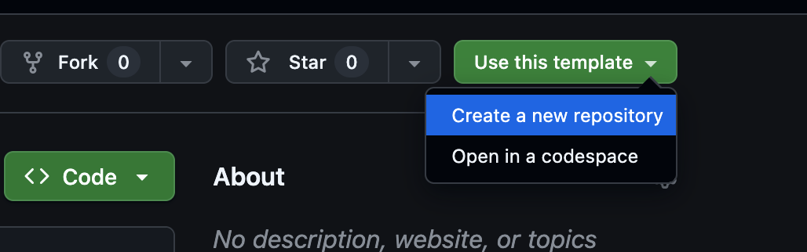
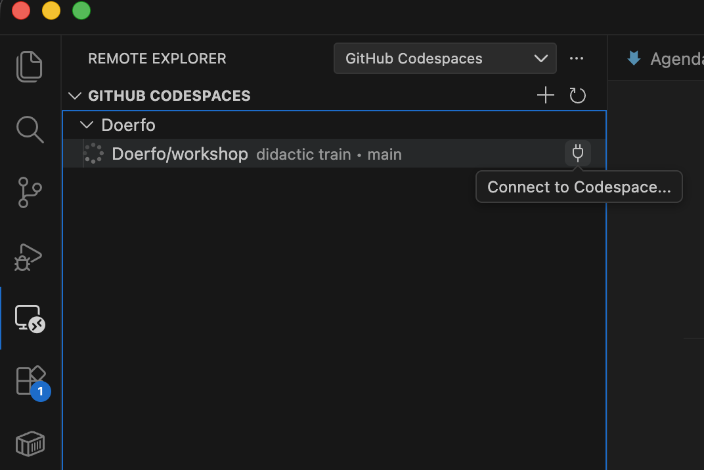

# Setup Repository for MCP Server

This task guides you through creating a GitHub repository and setting up your custom .NET MCP Server project locally.

## Prerequisites

- **.NET 10 SDK** - [Download](https://dotnet.microsoft.com/download/dotnet/10.0)
- **Visual Studio Code** with GitHub Copilot extension
- **Git** installed and configured
- **GitHub account**

---

## Part 1: Create GitHub Repository

### Step 1: Create Repository on GitHub

1. Go to [GitHub](https://github.com/Doerfo/WorkshopTemplate)
2. Click **"Use this template"** to create a new repository from the WorkshopTemplate

3. Configure the repository:
   - **Owner:** Select your user
   - **Repository name:** [e.g., `SampleMcpServer`]
   - **Visibility:** Public (recommended -> free advanced security features)
4. Click **"Create repository"**

### Step 2: Open in GitHub Codespace

> **Documentation:** [What are GitHub Codespaces?](https://docs.github.com/en/codespaces/about-codespaces/what-are-codespaces)  
> **Free quota:** 15 GB-month storage, 120 hrs/month compute

You can use GitHub Codespaces for a cloud-based development environment:

1. On your repository page, click the green **"Code"** button
2. Select the **"Codespaces"** tab
3. Click **"Create codespace on main"**
4. Close the opened browser tab (codespace will continue to run in background)
5. Install the **GitHub Codespaces** extension if not already installed:
   - Click the Extensions icon in the sidebar
   - Search for "GitHub Codespaces"
   - Click **Install**


6. Connect to your codespace



7. Wait for the codespace to load (may take a few minutes)

8. Once ready, install the **GitHub Copilot** extension if not already installed:
   - Click the Extensions icon in the sidebar
   - Search for "GitHub Copilot"
   - Click **Install**

> **Tip:** Codespaces come with .NET pre-installed, so you can skip local SDK installation.


### Step 3: (Optional) Clone Repository Locally Instead of Codespace

```bash
git clone https://github.com/<your-username>/<your-repository-name>.git
cd <your-repository-name>
```

---

## Part 2: Start MCP Server Project

### Step 4: Start the MCP Server Project

In Vscode on the left click Run and Debug.
Start the "McpServer http" configuration.

In the console you should see something like this:

```bash
Microsoft.Hosting.Lifetime: Information: Now listening on: http://localhost:5251
```

### Step 5 (Optional): Inspect the MCP Server

With MCP Inspector you can inspect the MCP server.

1. Install the MCP Inspector (on your local machine - not in the codespace):

```bash
npm install -g @modelcontextprotocol/inspector
```

2. Run the inspector and connect to your running server:

```bash
npx @modelcontextprotocol/inspector
```

3. Select the following configuration:
   - **Transport Type:** Streamable HTTP
   - **URL:** http://localhost:5251/mcp

4. Click **Connect**

5. Under **Tools**, you should see the `random-number` tool listed.

---

## Part 3: Configure VS Code for MCP Server

### Step 6: Add MCP Server Configuration

Check `.vscode/mcp.json` the MCP server configuration file. It should look like this:

```json
{
	"servers": {
		"random numbers": {
			"url": "http://localhost:5251/mcp",
			"type": "http"
		}
	},
	"inputs": [
	]
}
```

1. click start on the random number mcp server
2. ask for a random number between 1 and 100 in copilot chat

---

## Project Structure

```
SampleMcpServer/
├── .vscode/
│   └── mcp.json          # MCP server configuration
├── .gitignore            # From GitHub
├── SampleMcpServer.csproj
├── Program.cs
└── README.md             # Created on GitHub with Copilot
```

## Useful Resources

- [Microsoft Docs: Build MCP Server](https://learn.microsoft.com/en-us/dotnet/ai/quickstarts/build-mcp-server)
- [MCP C# SDK on GitHub](https://github.com/modelcontextprotocol/csharp-sdk)
