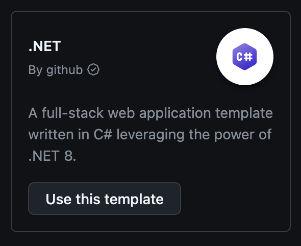
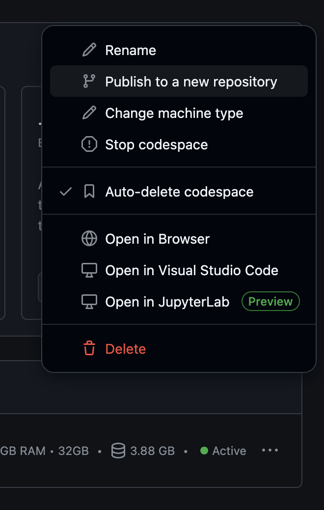
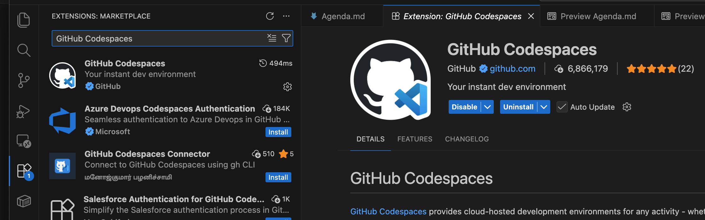

# Setup Repository

## Create Codespace from Template

1. Navigate to [GitHub Codespaces Templates](https://github.com/codespaces/templates)

2. Create repository from the **.NET template**

   

3. Close the automatically opened browser tab (codespace is still running)

## Optional: Publish to New Repository

1. Navigate to [GitHub Codespaces](https://github.com/codespaces)

2. Publish as new repository

   

3. Wait until repository is created

## Connect to Codespace Locally

1. Open Visual Studio Code locally

2. Install the **GitHub Codespaces extension** (if not already installed)

   

3. Connect to your codespace

   

4. Wait until codespace is ready

## Run the Application

1. Go to the **"Run and Debug"** tab and click **"Run all"**

2. Check under **Ports** that the processes are running

3. Open browser and test the application:
   - **Frontend**: http://127.0.0.1:8081/
   - **Backend**: http://127.0.0.1:8080/scalar/