````markdown
# Add Feature with Spec Kit: Notes Functionality

In this task, you'll use **Spec Kit** to add a complete notes management feature to your MCP Server. Instead of writing all the code yourself, you'll use the Spec-Driven Development workflow to let GitHub Copilot generate the implementation based on clear specifications.

This demonstrates how AI-assisted development works best when you focus on **what** you want to build before diving into **how**.

## Learning Objectives

- Use Spec Kit's specification-driven workflow with GitHub Copilot
- Define clear specifications that produce predictable AI-generated code
- Build a complete feature (notes store) for your MCP Server
- Practice the full spec → plan → tasks → implement cycle

---

## Prerequisites

- Completed [Setup Repository](01_setup-repository.md)
- Completed [Setup Instructions](02_setup-instructions.md)
- Completed [Add Prompts](03_add-prompts.md)
- **uv** package manager - [Install](https://docs.astral.sh/uv/getting-started/installation/)

---

## Part 1: Install Spec Kit

### Step 1: Install Spec Kit CLI

```bash
uv tool install specify-cli --from git+https://github.com/github/spec-kit.git
uv tool update-shell
```

### Step 2: Initialize Spec Kit in Your Project

```bash
specify init . --ai copilot
```

This creates:
- `.specify/` folder with templates
- Adds slash commands to `.github/prompts/`

### Step 3: Commit Spec Kit Configuration

```bash
git add .
git commit -m "Add Spec Kit configuration for AI-assisted development"
git push
```

---

## Part 2: Define Project Constitution

Open GitHub Copilot Chat and establish your project principles using the Spec Kit constitution command:

```
/speckit.constitution

This project is a .NET MCP Server that provides an in-memory notes store.

Project principles:
- Use the ModelContextProtocol.Server library with [McpServerTool] and [McpServerPrompt] attributes
- All tools must have clear [Description] attributes for AI discoverability
- Use dependency injection for services (register as Singleton for in-memory state)
- Return user-friendly formatted strings from tools (use emojis for status)
- Keep the implementation simple and focused on the workshop learning objectives
- Follow C# conventions and modern .NET patterns (records, primary constructors)
```

This creates a `constitution.md` file in `.specify/` that guides all future AI interactions.

---

## Part 3: Create the Specification

Use `/speckit.specify` to define **what** you're building (not how). This is the most important step - a clear specification produces better AI-generated code.


```
/speckit.specify

Build an in-memory notes store for the CustomMcpServer.

Features:
1. **Notes Management**
   - Each note has: ID (auto-generated), title, content, created timestamp, updated timestamp
   - Users can add, retrieve, list, search, update, and delete notes
   - Notes are ordered by creation date (newest first)
   - Search works on both title and content (case-insensitive)

2. **MCP Tools** (6 tools)
   - AddNote: Create a new note with title and content
   - GetNote: Retrieve a specific note by ID
   - ListNotes: Show all notes
   - SearchNotes: Find notes matching a query
   - UpdateNote: Modify an existing note's title and/or content
   - DeleteNote: Remove a note by ID

3. **MCP Prompts** (5 prompts for guided interactions)
   - QuickNote: Quickly capture a thought (generates title automatically)
   - SummarizeNotes: Get an overview of all notes
   - FindTopicNotes: Search for notes on a specific topic
   - MeetingNotes: Create a structured meeting notes template
   - CodeReviewNote: Create a structured code review note
```

After running, check `.specify/requirements.md` for completeness. The specification should capture all the features you want to build.

---

## Part 4: Generate the Technical Plan

Use `/speckit.plan` to define the technical approach. This bridges the gap between what you want and how to build it:

```
/speckit.plan

Technical stack and architecture:
- .NET 10 with ModelContextProtocol.Server library
- In-memory Dictionary<string, NoteItem> for storage
- NotesService class in Services/ folder (singleton)
- NotesTools class in Tools/ folder with [McpServerToolType]
- NotesPrompts class in Prompts/ folder with [McpServerPromptType]
- Register NotesService in Program.cs

File structure:
- Services/NotesService.cs - Data store with CRUD operations
- Tools/NotesTools.cs - MCP tool implementations
- Prompts/NotesPrompts.cs - MCP prompt templates
- Program.cs - Service registration

Note model:
- Use C# record: NoteItem(string Id, string Title, string Content, DateTime CreatedAt, DateTime? UpdatedAt)
- Generate 8-character IDs from GUID
```

This creates a `plan.md` file in `.specify/` with the technical approach.

---

## Part 5: Break Down Tasks

Use `/speckit.tasks` to create actionable implementation steps:

```
/speckit.tasks
```

Copilot will analyze your specification and plan, then generate a task breakdown. This typically includes:

1. Create the NoteItem record
2. Create the NotesService with CRUD operations
3. Create the NotesTools with all 6 MCP tools
4. Create the NotesPrompts with all 5 prompt templates
5. Register the service in Program.cs
6. Test the implementation

Review the generated tasks in `.specify/tasks.md`.

---

## Part 6: Implement with Copilot

Now let Copilot implement everything based on your specifications:

```
/speckit.implement
```

Copilot will:
1. Create the `NoteItem` record model
2. Create the `NotesService` with the in-memory store
3. Create the `NotesTools` with all 6 MCP tools
4. Create the `NotesPrompts` with all 5 prompt templates
5. Update `Program.cs` to register the service

Watch as Copilot generates each file according to your specification.

---

## Part 7: Review the Implementation

After implementation, verify the generated code:

### Expected File Structure

```
CustomMcpServer/
├── Services/
│   └── NotesService.cs
├── Tools/
│   └── NotesTools.cs
├── Prompts/
│   └── NotesPrompts.cs
├── Program.cs (updated)
└── ...
```

### Verify NotesService

The service should include:
- `NoteItem` record with Id, Title, Content, CreatedAt, UpdatedAt
- `ConcurrentDictionary<string, NoteItem>` for thread-safe storage
- Methods: `AddNote`, `GetNote`, `ListNotes`, `SearchNotes`, `UpdateNote`, `DeleteNote`

### Verify NotesTools

Each tool should have:
- `[McpServerTool]` attribute
- `[Description]` attribute for AI discoverability
- User-friendly return format with emojis

### Verify NotesPrompts

Each prompt should have:
- `[McpServerPrompt]` attribute
- `[Description]` attribute
- Return `PromptMessage` with clear template content

---

## Part 8: Test Your Implementation

### Build and Run

```bash
dotnet build
dotnet run
```

### Test via Copilot Chat

1. Open GitHub Copilot Chat in **Agent Mode**
2. Click the **Select tools** icon (🔧) to verify your notes tools appear
3. Try these interactions:

**Test Adding Notes:**
```
Add a note titled "Workshop Ideas" with content about MCP servers
```

**Test Listing Notes:**
```
List all my notes
```

**Test Searching:**
```
Search notes for "workshop"
```

**Test Prompts:**
```
Use the QuickNote prompt to capture: Remember to add error handling
```

**Test Meeting Notes:**
```
Use the MeetingNotes prompt for a sprint planning meeting
```

---

## Part 9: Iterate and Refine

If the implementation needs adjustments, use `/speckit.clarify`:

```
/speckit.clarify

The SearchNotes tool should also support searching by date range.
Add optional startDate and endDate parameters.
```

Then run `/speckit.implement` again to apply the changes.

---

## Part 10: Commit Your Feature

```bash
git add .
git commit -m "Add notes management feature with MCP tools and prompts"
git push
```

---

## Summary: The Spec Kit Workflow

```mermaid
flowchart LR
    A["📜 /speckit.constitution<br/>Project principles"] --> B["📋 /speckit.specify<br/>What to build"]
    B --> C["🔧 /speckit.plan<br/>Technical approach"]
    C --> D["📝 /speckit.tasks<br/>Task breakdown"]
    D --> E["🚀 /speckit.implement<br/>AI generates code"]
    
    style A fill:#238636,color:#fff
    style B fill:#0969da,color:#fff
    style C fill:#8957e5,color:#fff
    style D fill:#bf8700,color:#000
    style E fill:#cf222e,color:#fff
```



### What You Built

| Category | Items |
|----------|-------|
| **Tools** | `AddNote`, `GetNote`, `ListNotes`, `SearchNotes`, `UpdateNote`, `DeleteNote` |
| **Prompts** | `QuickNote`, `SummarizeNotes`, `FindTopicNotes`, `MeetingNotes`, `CodeReviewNote` |
| **Services** | `NotesService` with in-memory storage |
| **Model** | `NoteItem` record |

### Key Takeaways

1. **Specifications first** — Clear specs produce better AI-generated code
2. **Separation of concerns** — Define *what* before *how*
3. **Iterative refinement** — Use `/speckit.clarify` if results aren't right
4. **AI as implementer** — You architect, Copilot codes
5. **Consistency** — Constitution ensures consistent patterns across features

---

## Bonus: Add More Features

Now that you've learned the Spec Kit workflow, try adding more features:

### Feature Idea: Tags

```
/speckit.specify

Add tagging support to notes:
- Each note can have multiple tags
- Add tools: AddTagToNote, RemoveTagFromNote, ListNotesWithTag
- Tags are case-insensitive and stored lowercase
```

### Feature Idea: Note Categories

```
/speckit.specify

Add category support:
- Notes can belong to one category (optional)
- Categories: Work, Personal, Ideas, Meeting, Code
- Add tool: ListNotesByCategory
```

---

## Useful Resources

- [Spec Kit Repository](https://github.com/github/spec-kit)
- [Microsoft Docs: Build MCP Server](https://learn.microsoft.com/en-us/dotnet/ai/quickstarts/build-mcp-server)
- [MCP C# SDK on GitHub](https://github.com/modelcontextprotocol/csharp-sdk)
- [Workshop MCP Guide](../knowledge/mcp-server.md)
- [Workshop Spec Kit Guide](../knowledge/spec-kit.md)
````
